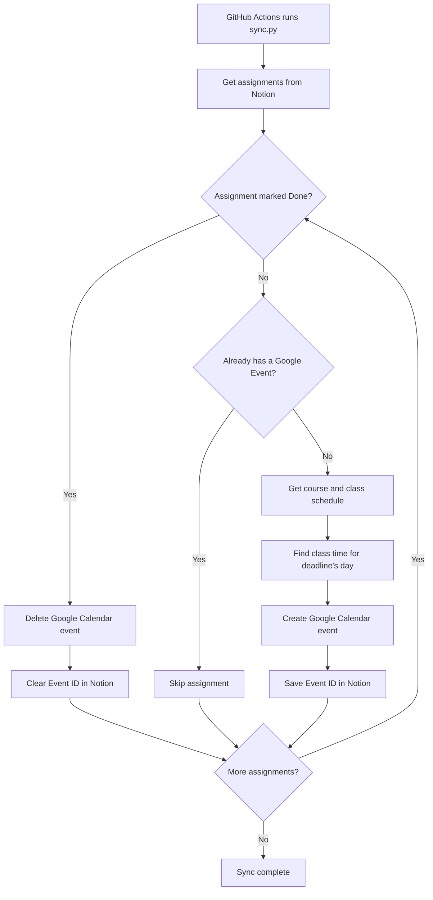

# Notion to Google Calendar Assignment Sync
An automated coursework management system that synchronizes assignments from a Notion database with Google Calendar using REST APIs and GitHub Actions.

This project automatically creates Google Calendar events from assignments stored in a Notion coursework database. Each assignment is matched with its corresponding course and meeting schedule, including day-specific class times. When an assignment is marked complete in Notion, its corresponding Google Calendar event is automatically deleted.

## Features
> __Notion API integration__
> * Reads assignments, deadlines, course information, and completion status. 
>
> __Google Calendar API integration__
> * Creates and deletes calendar events automatically. 
>
> __Day-aware scheduling__
> * Determines the appropriate class time based on the assignment's deadline day.
>
> __Duplicate prevention__
> * Stores Google Calendar event IDs in Notion so existing events aren't recreated.
>
> __Automatic completion syncing__
> * Deletes the associated Google Calendar event when an assignment is marked Done.
> 
> __Cloud execution__
> * Runs automatically using GitHub Actions.
>
> __Secure credentials__
> * API tokens and OAuth credentials are stored as GitHub Actions secrets rather than committed to the repository.>

## Setup
Assignments are added to the notion Deadlines database with course listed as relation to respective page.

Course pages list times at which courses gather, which informs times at which deadlines are listed in Google Calendar.

Some courses meet at different times on different days of the week. The program can parse for which line and respective meeting time applies for the day of the deadline.

## Execution

The program runs on an adjustable timer, ___. Assignments with no assigned google event ID are read as new and added to the calendar; assignemnts with an assigned ID are read as already created. Assignemnts that have already been created but are now marked as complete are deleted from the calendar.

## Program Structure
